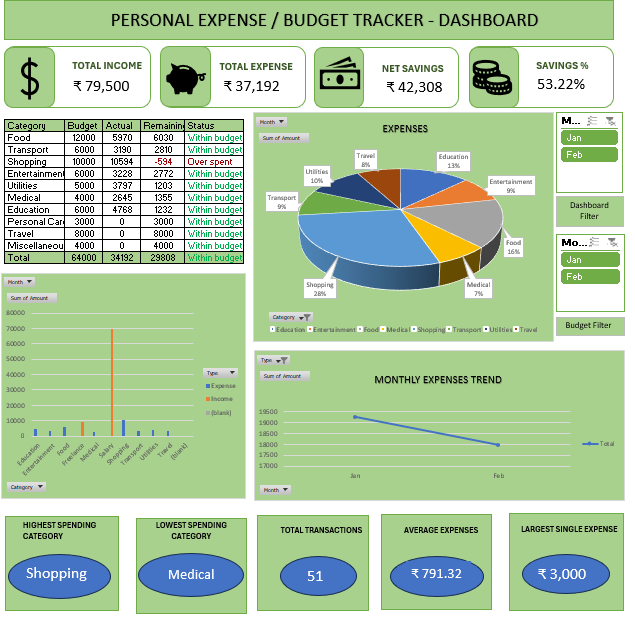

# personal-expense-budget-tracker-excel
Dynamic Excel dashboard for tracking personal expenses, budgets, savings, and monthly financial trends.
## Features
- Income and expense tracking
- Budget vs Actual comparison
- Savings percentage calculation
- Monthly expense trend analysis
- Interactive slicers and filters
- KPI cards for quick insights
- Pie chart and bar chart visualizations

## Tools Used
- Microsoft Excel
- Pivot Tables
- Pivot Charts
- Slicers
- Conditional Formatting

## Dashboard Preview

## File Included
- Personal expense budget tracker.xlsm

## Author
Donishka
